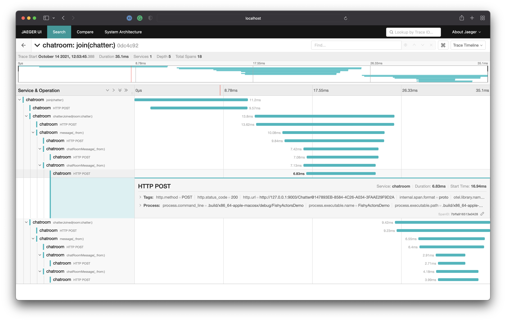

# swift-sample-distributed-actors-transport

Sample application and `ActorTransport`, associated with `distributed actor` language evolution proposal.

## Running the sample app

1. Download the latest toolchain from `main` branch, or a built one from a specific PR. 

3. Move it to `Library/Developer/Toolchains/` and point the TOOLCHAIN env variable at it:

```
export TOOLCHAIN=/Library/Developer/Toolchains/swift-DEVELOPMENT-SNAPSHOT-2021-09-18-a.xctoolchain
```

To run the sample app, use the following command:

```
cd SampleApp
DYLD_LIBRARY_PATH=$TOOLCHAIN/usr/lib/swift/macosx $TOOLCHAIN/usr/bin/swift run FishyActorsDemo
```

all necessary flags to build this pre-release feature are already enabled as unsafe flags in `Package.swift`.

If you wanted to perform the invocation manually, it would look something like this:

```
export TOOLCHAIN=/Library/Developer/Toolchains/swift-PR-39087-1109.xctoolchain
DYLD_LIBRARY_PATH=$TOOLCHAIN/usr/lib/swift/macosx $TOOLCHAIN/usr/bin/swift run FishyActorsDemo
```

setting the `DYLD_LIBRARY_PATH` is important, so don't forget it.

### Sample output

The sample is a chat room application. It creates a few "nodes" and starts distributed actors on them. 

There are two kinds of actors, a `ChatRoom` and `Chatter`s. A single node, representing a cloud component, hosts the chat room. And a few other nodes host chatters. Note that chatters can be on the same or on different nodes.

As the application runs, chatters join the remote `ChatRoom` and say hello there.

The chat room logs whenever a chatter joins the room, or sends a message:

```
// chat room logs
[:8001/ChatRoom@130A3D1B-...] Chatter [:9003/Chatter@0A2F138C-...] joined this chat room about: 'Cute Capybaras'
[:8001/ChatRoom@130A3D1B-...] Chatter [:9002/Chatter@8152F16D-...] joined this chat room about: 'Cute Capybaras'
[:8001/ChatRoom@130A3D1B-...] Chatter [:9003/Chatter@4F3970DE-...] joined this chat room about: 'Cute Capybaras'
[:8001/ChatRoom@130A3D1B-...] Forwarding message from [:9002/Chatter@8152F16D-...] to 2 other chatters...
[:8001/ChatRoom@130A3D1B-...] Forwarding message from [:9003/Chatter@4F3970DE-...] to 2 other chatters...
[:8001/ChatRoom@130A3D1B-...] Forwarding message from [:9003/Chatter@0A2F138C-...] to 2 other chatters...
[:8001/ChatRoom@130A3D1B-...] Forwarding message from [:9002/Chatter@8152F16D-...] to 2 other chatters...
[:8001/ChatRoom@130A3D1B-...] Forwarding message from [:9003/Chatter@4F3970DE-...] to 2 other chatters...
```

The chat room sends a `"Welcome ..."` message to a joining chatter, and forwards all other chat messages sent to the room to the chatter itself.
A chatters logs look like this: 

```
// first chatter
[:9002/Chatter@8152F16D-...] Welcome to the 'Cute Capybaras' chat room! (chatters: 2)
[:9002/Chatter@8152F16D-...] Chatter [:9003/Chatter@0A2F138C-...] joined [:8001/ChatRoom@130A3D1B-...] (total known members in room 2 (including self))
[:9002/Chatter@8152F16D-...]] :9003/Chatter@4F3970DE-... wrote: Welcome [:9003/Chatter@0A2F138C-...]!
[:9002/Chatter@8152F16D-...]] :9003/Chatter@0A2F138C-... wrote: Long time no see [:9002/Chatter@8152F16D-...]!
[:9002/Chatter@8152F16D-...] Chatter [:9003/Chatter@4F3970DE-...] joined [:8001/ChatRoom@130A3D1B-...] (total known members in room 3 (including self))
[:9002/Chatter@8152F16D-...]] :9003/Chatter@4F3970DE-... wrote: Hi there,  [:9002/Chatter@8152F16D-...]!
```

Notice that the simplified ID printout contains the port number of the node the chatter is running on. In this example, the chatroom is running on port `8001` while the chatter is on `9002`. Other chatters may be on the same or on different "nodes" which are represented by actor transport instances. 

This sample is a distributed application created from just a single process, but all the "nodes" communicate through networking with eachother.
The same application could be launched on different physical hosts (and then would have different IP addresses), this is what location transparency of distributed actors enables us to do.

### Distributed Tracing

Additionally, the calls can also be traced using "Swift Distributed Tracing". To use tracing for the sample app, start the services in [`docker-compose.yaml`](SampleApp/docker-compose.yaml), then run the sample again.

```sh
docker compose -p fishy-transport-sample up -d
```

Afterwards, open Jaeger [http://localhost:16686](http://localhost:16686) and you'll see traces similar to this:



### Experimental flags

> This project showcases **EXPERIMENTAL** language features, and in order to access them the `-enable-experimental-distributed` flag must be set.

The project is pre-configured with a few experimental flags that are necessary to enable distributed actors, these are configured in each target's `swiftSettings`:

```swift
      .target(
          name: "FishyActorTransport",
          dependencies: [
            ...
          ],
          swiftSettings: [
            .unsafeFlags([
              "-Xfrontend", "-enable-experimental-distributed",
              "-Xfrontend", "-validate-tbd-against-ir=none",
              "-Xfrontend", "-disable-availability-checking", // availability does not matter since _Distributed is not part of the SDK at this point
            ])
          ]),
```

## SwiftPM Plugin

Distributed actor transports are expected to ship with an associated SwiftPM plugin that takes care of source generating the necessary "glue" between distributed functions and the transport runtime.

Plugins are run automatically when the project is build, and therefore add no hassle to working with distributed actors.

### Verbose mode

It is possible to force the plugin to run in `--verbose` mode by setting the `VERBOSE` environment variable, like this:


```
VERBOSE=true DYLD_LIBRARY_PATH=$TOOLCHAIN/usr/lib/swift/macosx $TOOLCHAIN/usr/bin/swift run FishyActorsDemo

Analyze: /Users/ktoso/code/fishy-actor-transport/SampleApp/Sources/FishyActorsDemo/_PrettyDemoLogger.swift
Analyze: /Users/ktoso/code/fishy-actor-transport/SampleApp/Sources/FishyActorsDemo/Actors.swift
  Detected distributed actor: ChatRoom
    Detected distributed func: join
    Detected distributed func: message
    Detected distributed func: leave
  Detected distributed actor: Chatter
    Detected distributed func: join
    Detected distributed func: chatterJoined
    Detected distributed func: chatRoomMessage
Analyze: /Users/ktoso/code/fishy-actor-transport/SampleApp/Sources/FishyActorsDemo/main.swift
Generate extensions...
WARNING: This is only a *mock* sample plugin implementation, real functions won't be generated!
  Generate 'FishyActorTransport' extensions for 'distributed actor ChatRoom' -> file:///Users/ktoso/code/fishy-actor-transport/SampleApp/.build/plugins/outputs/sampleapp/FishyActorsDemo/FishyActorTransportPlugin/GeneratedFishyActors_1.swift
  Generate 'FishyActorTransport' extensions for 'distributed actor Chatter' -> file:///Users/ktoso/code/fishy-actor-transport/SampleApp/.build/plugins/outputs/sampleapp/FishyActorsDemo/FishyActorTransportPlugin/GeneratedFishyActors_1.swift
```
